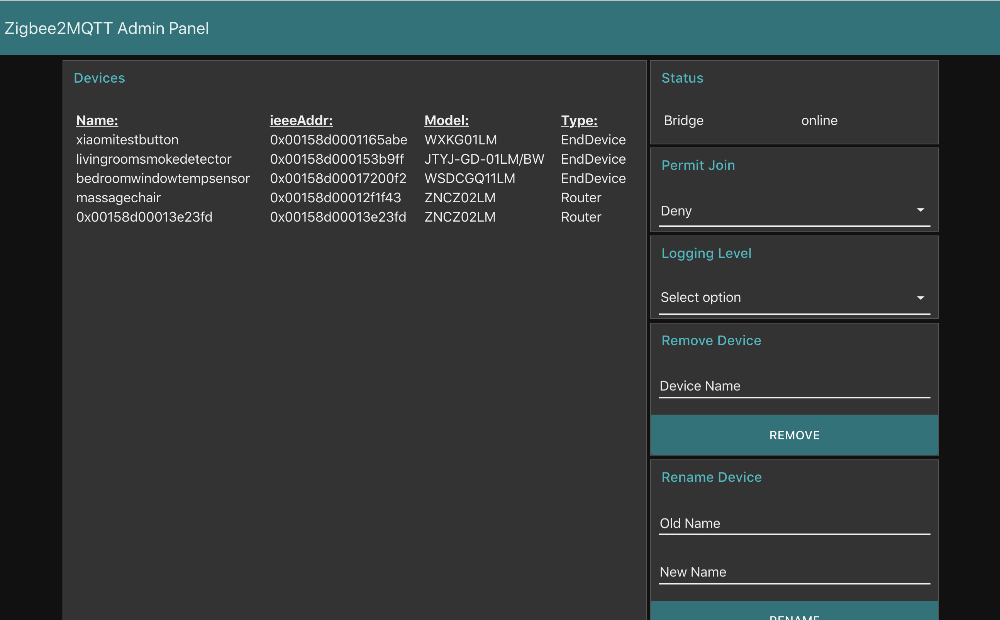

# Zigbee2MQTT Admin Panel
[Node-Red-Dashboard](https://github.com/node-red/node-red-dashboard) web interface for controlling [Zigbee2MQTT](https://github.com/Koenkk/zigbee2mqtt)

Features:
* Popup notifications indicating device pairing status (if pairing devices).
* Rename devices
* Remove devices
* Permit join
* Set the console logging level
* See if the Zigbee2MQTT bridge is online
* Display devices
* HTTP API

Instructions:

1) Install [Node-Red](https://nodered.org/)
2) Create a Flow called "Zigbee2MQTT Admin Panel"
3) Settings > "Manage palette" > Install, search for and install "node-red-dashboard"
4) Import flow into "Zigbee2MQTT Admin Panel" flow
5) Visit: http://ipaddress:1880/ui

A list of Node-Red flows for integrating Zigbee2MQTT devices with various home automation systems can be found [here](https://github.com/ben423423n32j14e/zigbee2mqttflowdevices).

HTTP API URLS (http://ipaddress:1880/):

* Bridge State: /adminpanelapi/state
* Device List (formatted in JSON): /adminpanelapi/devicelist
* Graphviz /adminpanelapi/networkmap/graphviz (suggest pasting into: http://viz-js.com/ or http://www.webgraphviz.com/)

Notes:
Currently in beta, some features may or may not work correctly.
